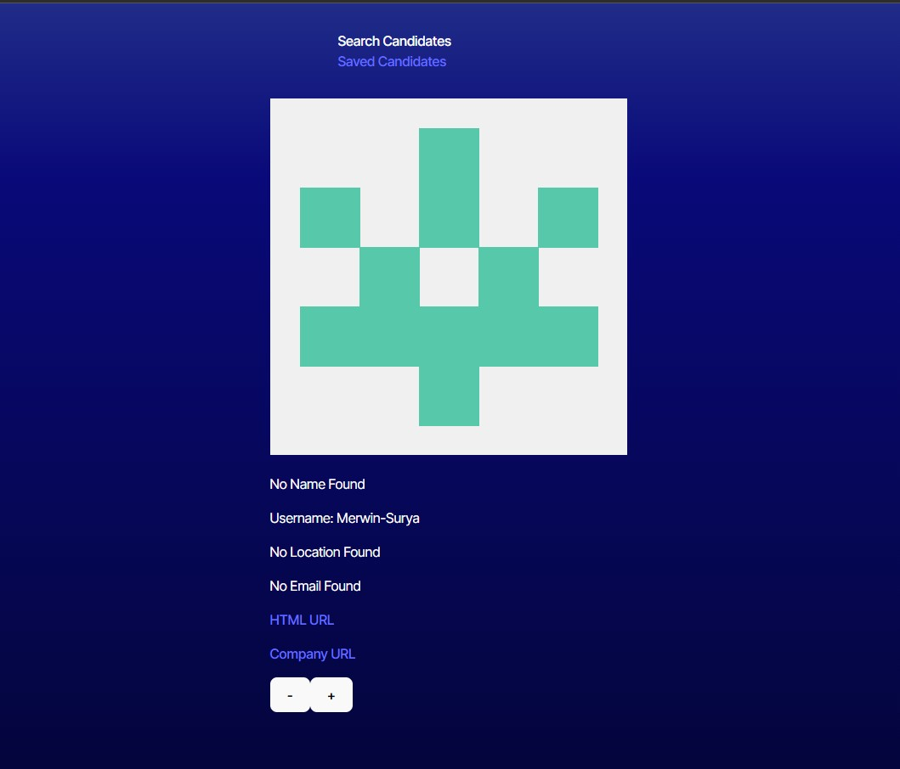

  # Candidate-Search   
  
  ## Description 

  Find new GitHub users to collaborate with by swiping through a deck of developers.

  ## Table of Contents

  - [Installation](#installation)
  - [Usage](#usage)
  - [License](#license)
  - [Dev](#dev)

  ## Installation

  Clone down the repo. Open root folder in terminal, install packages, and run the following command:
  1. npm run dev

  ## Usage

  Swipe through an endless stack of potential GitHub users, and browse through the users you've saved.

  ### Mock-Up
  
  

  ## License
  This application is covered under the [MIT](https://opensource.org/licenses/MIT) license.
  

  ## Dev

  Try the deployed [application](https://candidate-search-olf6.onrender.com/).

  Check out the [repo](https://github.com/michaelhdavies/candidate-search).

  Developed by [Michael Henry Davies](https://github.com/michaelhdavies/).

  [Back to Top](#description)
  
  